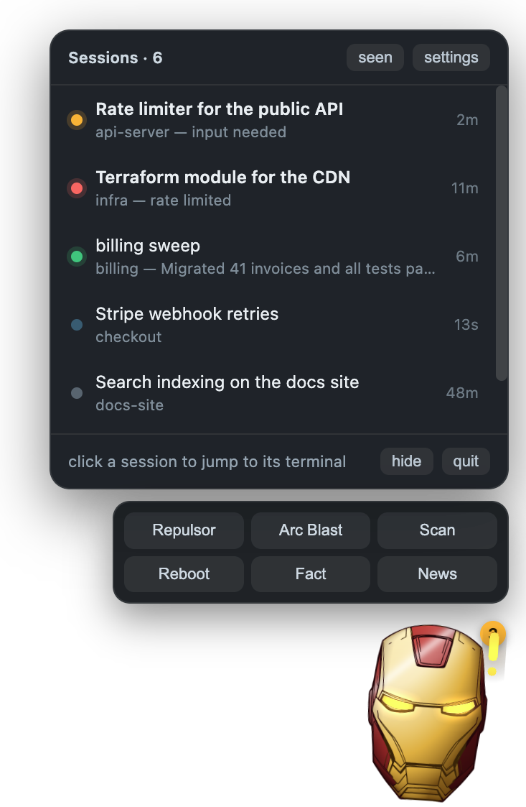
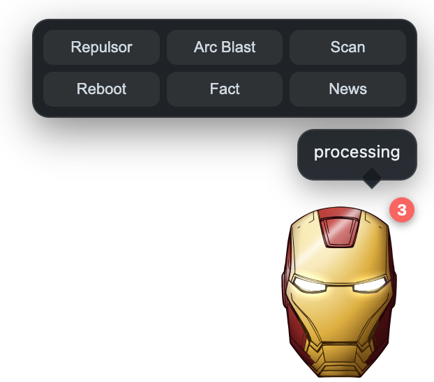
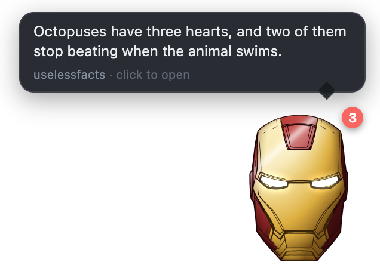
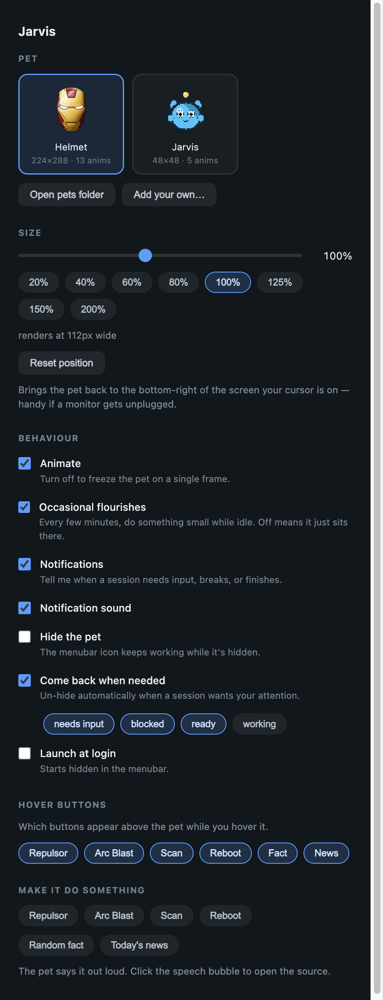

<div align="center">


# Jarvis

### Your Claude Code sessions have a face now.

**A desktop pet that watches every Claude Code session you have running, floats
above every window on every Space, and taps you on the shoulder the moment one
is stuck waiting on you.**


<sub>**idle** · **working** · **needs you** · **ready** · **blocked**</sub>

</div>

---

## The problem

You have eleven Claude Code sessions open. Two are working. One finished nine
minutes ago. One has been sitting on a permission prompt since you wandered off
to make coffee, and you have no idea which one.

Claude Code names them `prediction-markets-backend-77`, `prediction-markets-backend-8e`,
`prediction-markets-backend-a6` — which is, you'll agree, not enormously helpful.

## The fix

<div align="center">

</div>

Click the helmet. Every session, sorted by how much it needs you, **named by
what it's actually doing** — because Jarvis reads the same titles `/resume`
shows, not the project slug. Click any row and you land in the terminal running
it. The exact tab. Not the app, the tab.

The menubar icon is the pet's current state, so you can tell at a glance without
clicking anything at all.

## Why it's nice

- **Zero cost.** No API calls, no polling, no tokens. It reads state Claude Code
  already writes to disk and watches it with FSEvents.
- **Zero install into Claude Code.** No plugin, no hooks, no config edits.
  Nothing to undo but deleting the app.
- **~0.8% CPU.** 0.1% with animation off. 0.0% hidden. Measured, not guessed.
- **It knows the difference between busy and stuck.** A rate limit is not the
  same as a retry, and it won't cry wolf at you.

## Getting it

```bash
npm install
npm run build
cp -r dist/Jarvis-darwin-arm64/Jarvis.app /Applications/
```

Open it. There's no Dock icon and no app-switcher entry by design — it's an
`LSUIElement` app that lives in your menubar and never steals focus. Look for
the helmet up top.

Optional, but it's the good part:

```bash
npm run install-extension     # Cursor / VS Code / Windsurf
```

Without it, clicking a session raises your editor. With it, you land on the
**exact integrated terminal** that session is running in.

Needs **Node 18+** and macOS. Electron is the only dependency — the sprites and
the app icon are generated by scripts in this repo, so there's nothing to
download and no art to license.

## Living with it

<div align="center">

&nbsp;&nbsp;

</div>

**Hover** it for buttons. **Click** it for the session list. **Drag** it
anywhere — it remembers, and it survives you unplugging a monitor.

Two of those buttons aren't animations. **Fact** and **News** go and fetch
something for it to say, from a different source every time — no API key, no
account. Click the bubble to open the source.

```bash
npm run watch              # live table in the terminal
node src/cli.js focus 3    # jump to session 3's terminal
```

```
  JARVIS  NEEDS YOU   11 live sessions
  1 needs you  ·  1 working  ·  9 idle

  #  SESSION                                        PROJECT                STATE       AGE
   1 > Codex pets feature for Claude Code           claude_pet             WORKING     3m
   2 . tennis notification rules                    prediction-markets-ba… idle        19m
   8 . Tennis court level venue data integration    prediction-markets-ba… idle        3d
```

## Making it yours

<div align="center">

</div>

`Cmd+,` or the menubar. Swap pets, resize from 20% to 200%, pick which hover
buttons exist, turn the animation off entirely, hide it and have it come back
only when something needs you, launch at login.

**Add your own…** takes any sprite sheet. Or from the terminal:

```bash
npm run add-pet -- ~/Downloads/foxy.png --cols 6 --rows 5
```

Downloaded packs rarely ship our five states, but they map cleanly:

| Their row | Our state |
|---|---|
| idle | `idle` |
| walk / run | `running` |
| attack, or any "look at me" pose | `needs_input` |
| jump / celebrate / victory | `ready` |
| hurt / death | `blocked` |

---

# How it works

The interesting half. Skip it if you just wanted a helmet on your screen.

## It reads the future from `~/.claude`

Claude Code maintains a file per live session at `~/.claude/sessions/<pid>.json`:

```json
{ "pid": 86952, "cwd": "…", "name": "claude-pet-2f",
  "status": "waiting", "waitingFor": "input needed" }
```

`status` is `idle | busy | waiting`. We watch that directory with `fs.watch`
(FSEvents on macOS) — push, not poll. Session files outlive their process, so
dead ones are filtered with a `kill(pid, 0)` liveness check.

Errors, turn completion and **names** come from the transcript,
`~/.claude/projects/<slug>/<sessionId>.jsonl`, tailed from its current end:

| Entry | Gives us |
|---|---|
| `{"subtype":"api_error","retryAttempt":1,"maxRetries":10}` | `blocked` |
| `{"subtype":"turn_duration"}` | `ready` — a turn just finished |
| `{"type":"ai-title","aiTitle":"…"}` | the name `/resume` shows |
| `{"type":"user"}` | you're back; clear the badge |

### Blocked is deliberately hard to trigger

Claude Code emits an `api_error` on **every retry** and recovers from most of
them. Treating any error as "blocked" would have the pet on fire permanently:

```js
if (error.isNetworkDown)        return 'network down';
if (error.rateLimits)           return 'rate limited';
if (retryAttempt >= maxRetries) return 'retries exhausted';
if (retryAttempt >= 3)          return `retrying (${retryAttempt}/${maxRetries})`;
return null;                    // still recovering — stay quiet
```

### Names, and one inverted flag

Claude Code's own name for a session is the project slug plus two characters —
identical for every session in a repo. So the list shows the `ai-title` instead.

A name **you** set always wins, and detecting that is backwards from what you'd
expect: Claude Code writes `nameSource` *only when it invented the name*, so its
**absence** means you named it. Default that field and you silently overwrite
every rename. (Ask me how I know.)

## Landing on the exact terminal

Three mechanisms, because no two editors agree on anything.

**iTerm2 and Terminal.app** expose every session to AppleScript along with its
tty. Easy — read the tty from `ps`, select that tab.

**Cursor, VS Code and Windsurf** don't: integrated terminals are panes in a web
view, invisible to AppleScript. So:

1. **The right window.** Claude Code's IDE integration writes
   `~/.claude/ide/<port>.lock` naming each window's workspace folders. Find the
   most specific open folder containing the session's cwd, run `cursor <folder>`.
2. **The right terminal.** A small companion extension. Jarvis writes the Claude
   pid to a file; every open window walks the process tree:

   ```
   pid 86952  <- claude
   pid 86432  <- /bin/zsh                            <- Terminal.processId
   pid 3838   <- Cursor Helper: terminal pty-host
   pid 672    <- Cursor
   ```

   Whichever window finds one of its terminals in that chain calls
   `terminal.show()`. A plain file is the transport on purpose: no ports, no
   auth, and it reaches every window of every editor at once.

> **A packaged Mac app has almost no `PATH`.** It inherits
> `/usr/bin:/bin:/usr/sbin:/sbin` and nothing else, so `execFile('cursor', …)`
> failed with ENOENT — while working perfectly from a shell. Editor CLIs are
> resolved to absolute paths now, and the app is always activated as well, since
> activation is what actually pulls you across Spaces.

## The art is generated, not downloaded

There is no third-party artwork here. `tools/lib/pixel.js` is a small RGBA
canvas with a hand-rolled PNG encoder *and* decoder. Everything else is drawn
with it.

<div align="center">

<br><sub>All thirteen animation rows, one frame each</sub>
</div>

### Plating

The helmet starts as flat black line art. Colour comes from flood-filling it and
classifying the panels that fall out. Red is only two things — the **crest** at
the crown and the panels down the **outer edges**:

```js
const CREST_Y = 0.26;    // the crest sits above this height
const CREST_X = 0.46;    // ...and within this far of the centre line
const SIDE_X  = 0.78;    // outboard of this are the red edge panels
```

Every one of those boundaries is a line the artist already drew, so the colour
physically cannot land anywhere a line isn't. Earlier versions synthesised their
own seams to split panels the drawing left whole, and it always looked like
paint spilled over the linework.

### Shading

The plating is lit as a **curved shell**, not filled with a top-to-bottom ramp.
A surface normal is faked from each pixel's position — horizontal curve from a
per-row silhouette measurement, vertical from its height — and shaded by how
much it faces a light in the upper left:

```js
const nz = Math.sqrt(Math.max(0.02, 1 - sx * sx * 0.86 - sy * sy * 0.40));
const lambert = clamp(-sx * 0.42 - sy * 0.46 + nz * 0.78, 0, 1);
```

Then a broad sheen and a tight specular streak. That's the difference between
domed metal and a colouring book.

### The arc reactor

Drawn from primitives too — housing, copper coils, glow ring, and the triangle
as a signed-distance outline — parameterised by `glow`, `spin`, `blast`,
`alpha` and `housing`.

**Boot**, on every launch: the reactor spins up in empty space, flares, and the
helmet's own plates fly in and seat around it before the eyes come on. The
fifteen largest panels become plates and every smaller panel joins its nearest,
so neighbouring pieces travel together like real plating. Outer plates leave
first and travel furthest, so it closes inward.

<div align="center"></div>

**Arc Blast**: beams converge on the wind-up, the helmet leans into it, then a
white detonation throws an anamorphic flare, radial rays, sparks and expanding
shockwaves — and the reactor **lights the plating back**, so it reads as a light
source in front of the helmet rather than a sticker on top of it.

<div align="center"></div>

> Every image in this README is generated: the sprite strips by `npm run docs`
> from the sheet itself, and the UI shots by `npm run shots`, which drives the
> real renderer and captures it with Electron's own `capturePage()`. They can't
> drift from the thing they document.

## Making it cheap

Animating a transparent always-on-top window costs roughly **0.4% CPU per frame
per second**, whatever is in the frame:

| fps | 2 | 5 | 10 | 20 |
|---|---|---|---|---|
| CPU | 0.8% | 2.2% | 3.0% | 12.4% |

With the canvas never touched but the timer still running: **0.1%**. So it's the
compositing — not the JavaScript, not the resampling, not the window size, and
promoting the canvas to its own layer doesn't help either.

Which means the only real lever is *how often* something changes. So:

- **`idle` is a single frame.** No animation clock is scheduled at all. The pet
  sits perfectly still and every 1.5–4 minutes does one small thing.
- **Long-held states play at full rate in bursts.** `running` sweeps its scanner
  for three seconds every thirteen — same animation, a quarter of the duty cycle.
- **Alerts settle.** A session can sit in `needs_input` for days; after a minute
  the sprite freezes on its first frame and replays for four seconds every
  ninety. The badge and colour still carry the signal.
- **The pet is a canvas, not a CSS `background-image`.** The sheet is 13
  megapixels; rescaling all of it and shifting `background-position` every frame
  cost several percent.

| | CPU |
|---|---|
| **Idle** | **~0.8%** |
| Animation off | 0.1% |
| Hidden | 0.0% |

> The single worst offender was elsewhere entirely: the tray icon called
> `nativeImage.createFromPath()` on the sprite sheet for **every state change**,
> decoding 13.4 megapixels and ~51 MB each time. That was 8–12% of the main
> process on its own. Icons are cropped once per pet now.

## The three lines that make it a pet

```js
win.setAlwaysOnTop(true, 'screen-saver');                           // above fullscreen apps
win.setVisibleOnAllWorkspaces(true, { visibleOnFullScreen: true }); // every Space
win.setIgnoreMouseEvents(true, { forward: true });                  // clicks pass through
```

`forward: true` keeps mousemove flowing to the renderer even while the window
ignores clicks, so it can hit-test the cursor and re-enable input only over the
pet. And because the overlay is click-through it *stops* receiving mousemove the
instant your pointer moves onto another window — so while the hover bar is up,
the main process polls the real screen cursor to know when you've left.

## Multiple monitors

Anchors are absolute screen coordinates, so unplugging a display or dropping the
pet into the gap between two monitors could strand it where you can't grab it.

- **On drop and on startup**, it's pulled fully inside whichever display it
  overlaps most
- **Mid-drag** the clamp is loose — a quarter visible is enough — so moving
  between monitors doesn't fight you
- **Display added / removed / rearranged** re-clamps and re-saves

**Reset position** parks it bottom-right of whichever screen your cursor is on.

## Layout

```
src/core/sessions.js     read + watch ~/.claude/sessions, liveness filtering
src/core/transcripts.js  tail transcripts: errors, turn ends, /resume titles
src/core/state.js        merge both into one state machine
src/core/focus.js        process-tree walk, AppleScript, editor bridge
src/core/feeds.js        rotating no-key sources for facts and headlines
src/core/import-pet.js   sprite sheet import, shared by CLI and Settings
src/cli.js               the terminal UI
src/app/main.js          Electron: window flags, tray, notifications
src/app/renderer/        canvas sprite animation, session panel, hit-testing
src/app/settings/        the settings window
extension/               VS Code companion for exact-terminal focus
tools/lib/pixel.js       RGBA canvas, PNG encoder and decoder
tools/lib/arc-reactor.js the arc reactor, drawn from primitives
tools/make-helmet.js     line art -> coloured, animated sheet
tools/make-shots.js      real UI screenshots via capturePage()
```

## Platform status

| | |
|---|---|
| **macOS** | Full support — all Spaces, fullscreen, exact-terminal focusing |
| **Windows** | Window and tray work. `setVisibleOnAllWorkspaces` is a no-op, so it lives on one virtual desktop. Terminal focusing is macOS-only: the extension bridge would port, the AppleScript half wouldn't. |
| **Linux** | X11 fine. Wayland can't position windows or reliably keep them on top — needs a tray-only fallback. |

---

<div align="center">
<sub>Built for the specific misery of losing track of eleven Claude Code sessions at once.</sub>
</div>
