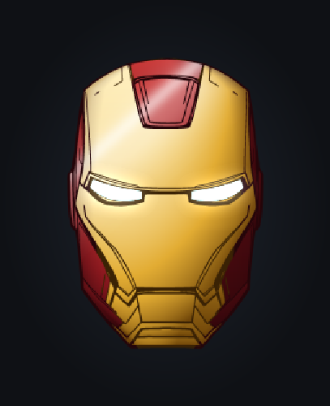
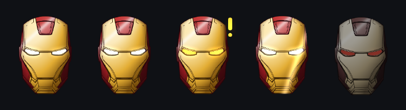
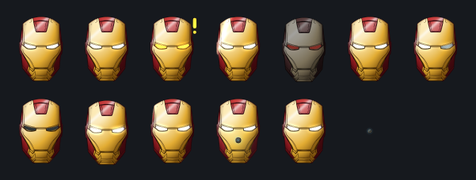
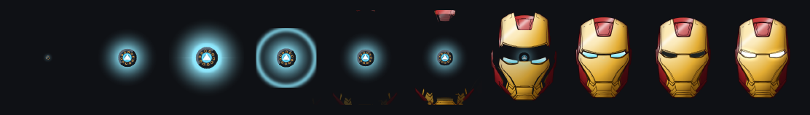
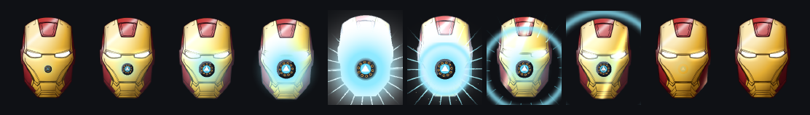

<div align="center">



# Jarvis

**A desktop pet that watches every Claude Code session you have running,
floats above every window on every Space, and tells you the moment one is
waiting on you.**



<sub>idle · working · needs you · ready · blocked</sub>

</div>

---

## Why

You end up with a dozen Claude Code sessions open across projects. Some are
working, some finished ten minutes ago, and one is sitting on a permission
prompt you haven't noticed. Jarvis puts that on your screen without you having
to go looking.

- **Live status for every session** — read from disk, not polled, not billed
- **Click a session, land on its terminal** — the exact tab, not just the app
- **Notifications** when something needs you, breaks, or finishes
- **Nothing installed into Claude Code** — no plugin, no hooks, no config edits
- **~2% CPU**, and literally 0% with animation off

## Install

```bash
npm install
npm run build
cp -r dist/Jarvis-darwin-arm64/Jarvis.app /Applications/
```

Open it from Applications. It's an `LSUIElement` app: **no Dock icon, no
app-switcher entry, never steals focus.** Look for the helmet in your menubar.

Optionally, so that clicking a session lands on the *exact* integrated terminal:

```bash
npm run install-extension     # Cursor / VS Code / Windsurf
```

Requires **Node 18+** and macOS. Electron is the only dependency; the sprites
and the app icon are generated by scripts in the repo, so there is nothing to
download and no art to license.

## Using it

| | |
|---|---|
| **Hover the pet** | Action buttons appear above it |
| **Click the pet** | Opens the session list |
| **Click a session** | Jumps to the terminal running it |
| **Drag the pet** | Moves it; the position is remembered |
| **Menubar icon** | Is the current state, and carries the same list |
| `Cmd+,` | Settings · `Cmd+Shift+J` hides and shows the pet |

From the terminal:

```bash
npm run watch              # live table, redraws on change
npm run status             # one-shot
node src/cli.js focus 3    # jump to session 3's terminal
node src/cli.js json       # machine-readable snapshot
```

```
  JARVIS  NEEDS YOU   10 live sessions
  1 needs you  ·  2 working  ·  7 idle

  #  SESSION                        PROJECT                  STATE       AGE   NOTE
   1 > claude-pet-2f                claude_pet               WORKING     5m
   9 ! prediction-markets-backend-… prediction-markets-back… NEEDS YOU   3d    input needed
```

## Settings

Menubar → **Settings…**, or the button in the session panel.

| | |
|---|---|
| **Pet** | Switch pets, or **Add your own…** to import a sprite sheet |
| **Size** | 20–200% slider; the window resizes around the pet |
| **Hover buttons** | Choose which buttons exist |
| **Animate** | Freeze the pet entirely |
| **Occasional flourishes** | Do something small every few minutes while idle |
| **Notifications** | Needs-input, blocked and finished; click one to jump there |
| **Hide the pet** | Menubar keeps working |
| **Come back when needed** | Un-hide automatically on states you pick |
| **Reset position** | Recover it if a monitor gets unplugged |
| **Launch at login** | Starts hidden in the menubar |

---

## How it knows, without being told

**Live status** comes from `~/.claude/sessions/<pid>.json`, which Claude Code
maintains for every running session:

```json
{ "pid": 86952, "sessionId": "…", "cwd": "…", "name": "claude-pet-2f",
  "status": "waiting", "waitingFor": "input needed", "updatedAt": 1787997308530 }
```

`status` is `idle | busy | waiting`. That directory is watched with `fs.watch`
(FSEvents on macOS), so it's push, not poll — **no API calls, no polling loop,
no tokens.** Session files outlive their process, so dead ones are filtered with
a `kill(pid, 0)` liveness check.

**Errors and turn completion** come from the transcript,
`~/.claude/projects/<slug>/<sessionId>.jsonl`, tailed from its current end:

| Transcript entry | Gives us |
|---|---|
| `{"subtype":"api_error","retryAttempt":1,"maxRetries":10,…}` | `blocked` |
| `{"subtype":"turn_duration",…}` | `ready` — a turn just finished |
| `{"type":"assistant",…}` | the message shown on the row |
| `{"type":"user"}` | you're back; clear the badge |
| `{"type":"ai-title","aiTitle":"…"}` | the name `/resume` shows |

**Session names.** Claude Code's own name for a session is the project plus two
characters — `prediction-markets-backend-77` — which is the same for every
session in a repo and tells you nothing. So the list shows the **title
`/resume` shows** instead, read from the transcript's `ai-title` entries and
kept live as Claude Code retitles the conversation.

A name you set yourself always wins. Claude Code only writes `nameSource` when
it invented the name, so its *absence* means you named it — the field must not
be defaulted. Hover a row to see the underlying session name, which is what
`claude --resume` and session messaging take as an address.

Claude Code emits an `api_error` on **every retry attempt** and recovers from
most of them, so treating any error as "blocked" would cry wolf constantly. A
session is only blocked when it is genuinely stuck:

```js
if (error.isNetworkDown)        return 'network down';
if (error.rateLimits)           return 'rate limited';
if (retryAttempt >= maxRetries) return 'retries exhausted';
if (retryAttempt >= 3)          return `retrying (${retryAttempt}/${maxRetries})`;
return null;                    // still recovering — stay quiet
```

Highest priority wins the pet's body; the panel lists every session separately:
`needs_input` → `blocked` → `ready` → `running` → `idle`.

**Notifications never repeat.** The state each session was last announced in is
persisted, and the first snapshot after launch is recorded silently — otherwise
every relaunch re-announced everything already waiting.

## Landing on the exact terminal

Three mechanisms, because the editors don't agree on anything.

**iTerm2 and Terminal.app** expose every session to AppleScript along with its
tty, so we read the tty from `ps` and select that exact tab.

**Cursor, VS Code and Windsurf** don't — integrated terminals are panes in a web
view, invisible to AppleScript. So it takes two halves:

1. **The right window.** Claude Code's IDE integration writes
   `~/.claude/ide/<port>.lock` naming each window's workspace folders. We find
   the most specific open folder containing the session's cwd and run
   `cursor <folder>`, which focuses the existing window rather than opening one.

2. **The right terminal.** `extension/` is a small companion extension. Jarvis
   writes the Claude pid to a file; every open window walks the process tree:

   ```
   pid 86952  <- claude
   pid 86432  <- /bin/zsh                            <- Terminal.processId
   pid 3838   <- Cursor Helper: terminal pty-host
   pid 672    <- Cursor
   ```

   `Terminal.processId` gives each terminal's shell pid. Whichever window finds
   one of its terminals in that chain calls `terminal.show()`. A plain file is
   the transport on purpose: no ports, no auth, and it reaches every window of
   every editor at once.

## The art is generated, not downloaded

There is no third-party artwork in this repo. `tools/lib/pixel.js` is a small
RGBA canvas with a hand-rolled PNG encoder and decoder; everything else is drawn
with it.

<div align="center">

<br><sub>All thirteen animation rows, one frame each</sub>
</div>

### Plating

Colour comes from flood-filling the line art and classifying the panels it
finds. Red is only two things — the raised **crest** at the crown and the panels
down the **outer edges**:

```js
const CREST_Y = 0.26;    // the crest sits above this height
const CREST_X = 0.46;    // ...and within this far of the centre line
const SIDE_X  = 0.78;    // outboard of this are the red edge panels
```

Every one of those boundaries is a line the artist already drew, so the colour
cannot land anywhere a line isn't. Earlier versions synthesised their own seams
to split panels the drawing left whole, which always read as paint spilled over
the linework.

### Shading

The plating is lit as a **curved shell**, not filled with a top-to-bottom ramp.
A surface normal is faked from each pixel's position — horizontal curve from a
per-row silhouette measurement, vertical from its height — and shaded by how
much it faces a light in the upper left:

```js
const nz = Math.sqrt(Math.max(0.02, 1 - sx * sx * 0.86 - sy * sy * 0.40));
const lambert = clamp(-sx * 0.42 - sy * 0.46 + nz * 0.78, 0, 1);
```

Then a broad sheen and a tight specular streak on top. This is what makes it
read as domed metal rather than a coloured-in outline.

### The arc reactor

`tools/lib/arc-reactor.js` draws it from primitives — housing, copper coils,
glow ring, and the triangle as a signed-distance outline — parameterised by
`glow`, `spin`, `blast`, `alpha` and `housing`, so it scales to any size.

**Boot**, played on every launch: the reactor spins up in empty space, flares,
and the helmet's own plates fly in and seat around it before the eyes come on.
The fifteen largest panels become plates and every smaller panel joins its
nearest, so neighbouring pieces travel together like real plating. Outer plates
leave first and travel furthest, so the helmet closes inward.

<div align="center">

</div>

**Arc Blast**: beams converge on the wind-up, the helmet leans into it, then a
white detonation throws an anamorphic flare, radial rays, sparks and expanding
shockwave rings — and the reactor **lights the plating back**, so it reads as a
light source in front of the helmet rather than a sticker on top of it.

<div align="center">

</div>

> These images are generated from the sprite sheet by `npm run docs`, so they
> are the actual frames the app draws and they refresh whenever the art does.

## Fact and news

Two buttons fetch something for the pet to say. **No API key and no account**,
and each press picks a **different source at random**:

| | |
|---|---|
| **News** | Google News (top plus eight rotating topics), BBC News / Technology / Science, NPR, Hacker News, Ars Technica, The Verge, Al Jazeera, Sky News |
| **Fact** | uselessfacts, Numbers API, catfact.ninja, a random Wikipedia summary, and the top post from r/todayilearned |

Sources are tried in random order and fall through on failure, so a site being
down or reshaped degrades to the next rather than breaking the button. The
result appears in the speech bubble with its publisher, and the bubble becomes
clickable.

## Making it yours

```bash
npm run sprite     # redraw the built-in pixel pet
npm run helmet     # rebuild the helmet from its line art
npm run icon       # rebuild the app icon from the active pet
npm run docs       # rebuild the images in this README
```

### Import a sheet you downloaded

```bash
npm run add-pet -- ~/Downloads/foxy.png --cols 6 --rows 5
```

It reads the PNG header for real dimensions, works out the frame size,
scaffolds `pets/foxy/pet.json`, and prints the row mapping it guessed. The same
import runs behind **Add your own…** in Settings.

Downloaded packs rarely use our five states, but they map cleanly:

| Their row | Our state |
|---|---|
| idle | `idle` |
| walk / run | `running` |
| attack, or any "look at me" pose | `needs_input` |
| jump / celebrate / victory | `ready` |
| hurt / death | `blocked` |

### The manifest

```json
{
  "id": "helmet",
  "sheet": "helmet.png",
  "frameWidth": 224, "frameHeight": 288, "scale": 0.5,
  "rendering": "auto",
  "animations": { "idle": { "row": 0, "frames": 1, "fps": 1 } },
  "flourishes": { "idle": ["idle_scan", "idle_look", "idle_power"] },
  "boot": "boot",
  "actions": {
    "poke": { "animation": "poke", "once": true },
    "ping": { "animation": "ping", "once": true, "label": "Repulsor" }
  }
}
```

**Actions** are one-shots that play through once and hand back to the current
state; any with a `label` becomes a hover button. **Flourishes** are the
livelier idle rows, played *rarely*. `rendering: "auto"` turns off
nearest-neighbour scaling for detailed sprites; pixel art wants the default.

At rest the pet is **completely still** — `idle` is a single frame, so the
renderer schedules no animation clock at all — and every 1.5 to 4 minutes it
plays one flourish and settles back.

**Settles** name the states that should quieten down. A session can sit in
`needs_input` for days; animating that the whole time is exhausting to sit next
to, but going silent loses the signal. So after a minute the sprite freezes on
its first frame — the badge and the colour still say what is happening — and
every 90 seconds it plays for four seconds as a reminder. `running` doesn't
settle, but it no longer bounces either: it holds a slow scanner sweep, because
it is a status you hold for minutes, not an event.

## Cost

All four Electron processes summed, with ten sessions tracked:

| | CPU |
|---|---|
| **Idle** | **~2%** |
| **Animation off** | **0.0%** — no timer is scheduled |
| **Pet hidden** | **0.0%** |
| During a 3s alert nudge | ~4% |

Three things dominated before they were fixed, and all three are worth knowing
if you change the UI:

1. **A permanently running CSS transform animation cost ~7% on its own.** The
   alert nudge composites the whole transparent window at 60fps for as long as a
   session is waiting. It now fires in ~3s bursts on a 30s cycle.
2. **`requestAnimationFrame` fires 60 times a second regardless.** The sprite is
   stepped by a timer at its own frame rate instead, and a single-frame row
   schedules nothing at all.
3. **The pet is drawn on a canvas, not a CSS `background-image`.** The sheet is
   13 megapixels; rescaling all of it and shifting `background-position` every
   frame cost several percent, where `drawImage` samples only the frame in use.

There is no polling anywhere. Hiding the pet pauses the renderer's clock
explicitly, because a hidden Electron window still runs its timers.

## The three lines that make it a pet

```js
win.setAlwaysOnTop(true, 'screen-saver');                           // above fullscreen apps
win.setVisibleOnAllWorkspaces(true, { visibleOnFullScreen: true }); // every Space
win.setIgnoreMouseEvents(true, { forward: true });                  // clicks pass through
```

`forward: true` keeps mousemove flowing to the renderer even while the window
ignores clicks, so it can hit-test the cursor and re-enable input only over the
pet. Because the overlay is click-through it *stops* receiving mousemove the
moment the pointer moves onto another window, so while the hover bar is up the
main process polls the real screen cursor to know when it has left.

## Multiple monitors

Anchors are absolute screen coordinates, so unplugging a display or dropping the
pet between two monitors could strand it.

- **On drop and on startup**, it is pulled fully inside whichever display it
  overlaps most
- **Mid-drag** the clamp is loose — a quarter visible is enough — so moving
  between monitors doesn't fight you
- **`display-added` / `removed` / `metrics-changed`** re-clamp and re-save

**Reset position** parks it bottom-right of whichever screen your cursor is on.

## Layout

```
src/core/sessions.js     read + watch ~/.claude/sessions, liveness filtering
src/core/transcripts.js  tail each session's transcript: errors, turn ends
src/core/state.js        merge both into one state machine
src/core/focus.js        process-tree walk, AppleScript, editor bridge
src/core/feeds.js        rotating no-key sources for facts and headlines
src/core/import-pet.js   sprite sheet import, shared by CLI and Settings
src/cli.js               the terminal UI
src/app/main.js          Electron: window flags, tray, notifications
src/app/renderer/        canvas sprite animation, session panel, hit-testing
src/app/settings/        the settings window
extension/               VS Code companion for exact-terminal focus
tools/lib/pixel.js       RGBA canvas, PNG encoder and decoder
tools/lib/art.js         the built-in pixel pet, drawn from primitives
tools/lib/arc-reactor.js the arc reactor, drawn from primitives
tools/make-helmet.js     line art -> coloured, animated sheet
```

## Platform status

| | |
|---|---|
| **macOS** | Full support — all Spaces, fullscreen, exact-terminal focusing |
| **Windows** | Window and tray work. `setVisibleOnAllWorkspaces` is a no-op, so it lives on one virtual desktop. Terminal focusing is macOS-only; the extension bridge would port, the AppleScript half would not. |
| **Linux** | X11 fine. Wayland cannot position windows or reliably keep them on top — needs a tray-only fallback. |
